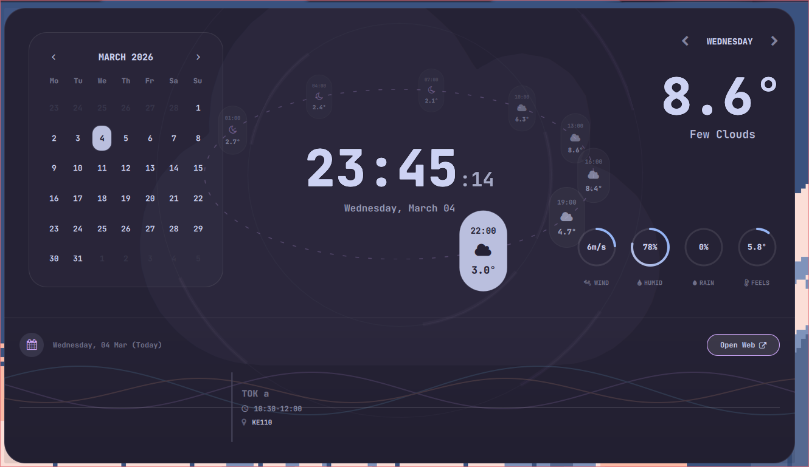

[](https://ko-fi.com/ilyamiro)

## Arch installer now in alpha testing mode available for everyone. Just run this: 

```bash
bash -c "$(curl -fsSL https://raw.githubusercontent.com/ilyamiro/imperative-dots/master/install.sh)"
```

> [!WARNING]
> DO NOT LAUNCH THIS AS ROOT!

> [!NOTE]
> This installer sends anonymous non-identifying telemetry that helps me debug problems and track the amount of users

### You can find all of my wallpapers **[HERE](https://github.com/ilyamiro/shell-wallpapers)**.

### FOR ANY PROBLEMS, contact me:

* Reddit: [https://reddit.com/r/ilyamiro1](https://reddit.com/r/ilyamiro1)
* X/Twitter: [https://twitter.com/ilyamirox](https://twitter.com/ilyamirox)
* Discord: [https://discord.com/users/ilyamiro](https://discord.com/users/ilyamiro)
* Email: [ilyamiro.work@gmail.com](mailto:ilyamiro.work@gmail.com)
* Telegram: [https://t.me/sacrificeit](https://t.me/sacrificeit)


## Previews of my desktop

---





